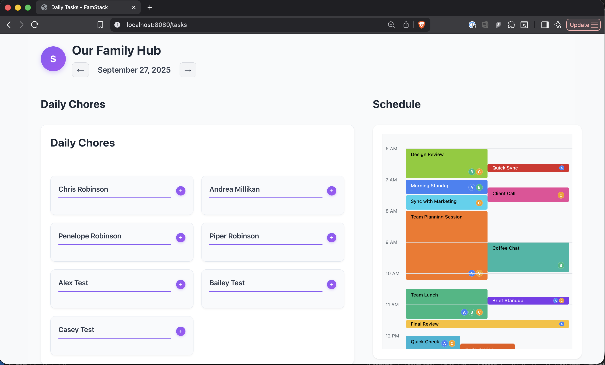

# FamStack

**⚠️ Work in Progress** - This project is actively being developed. Basic functionality works, but some features are still missing.

A family heads-up display for daily tasks and schedules. Shows today's calendar events and chores on a shared screen.

## What it looks like now

Here's what FamStack looks like when you open it:



**What you see:**
- **Our Family Hub**: Shows your family name with a colored avatar
- **Today's date**: Click the arrows to see yesterday or tomorrow
- **Daily chores**: Each family member gets their own column for tasks
- **Today's schedule**: All your meetings and events in a timeline view

## What it does

- Track family tasks and chores
- Manage appointments and schedules
- Works on your own computer (no cloud required)
- One file - just download and run

## Setup (5 minutes)

### Option 1: Download and run (easiest)

1. **Download the file for your computer:**
   - Go to [releases](https://github.com/chrisrob11/famstack/releases)
   - Download `famstack-linux-amd64` (Linux)
   - Download `famstack-darwin-amd64` (Mac)
   - Download `famstack-windows-amd64.exe` (Windows)

2. **Make it runnable (Mac/Linux only):**
   ```bash
   chmod +x famstack-*
   ```

3. **Create your first user:**
   ```bash
   ./famstack user create
   ```
   Enter your email, name, and password when asked.

4. **Start FamStack:**
   ```bash
   ./famstack start
   ```

5. **Open in your browser:**
   Go to http://localhost:8080 and log in with the account you just created.

### Option 2: Build from source

**Requirements:** Go 1.24+ and Node.js 23+

```bash
# Download the code
git clone https://github.com/chrisrob11/famstack.git
cd famstack

# Build it
make build

# Create a user
./famstack user create

# Start it
./famstack start
```

Then open http://localhost:8080

## Updating

### Check for updates
```bash
./famstack update check
```

### Install latest version
```bash
./famstack update install
```

### Show current version
```bash
./famstack update version
```

## Configuration

### Server options
```bash
./famstack start --port 8080 --db famstack.db
```

### Environment variables
- `PORT` - Server port
- `DATABASE_PATH` - Database file location

## Development

Requires Go 1.24+ and Node.js 23+

```bash
make dev-setup  # First time setup
make dev        # Start development server
make test       # Run tests
make lint       # Check code
```

## What works

- **Daily view**: See tasks and calendar events on one screen
- **Task management**: Create, edit, delete, and assign tasks to family members
- **Family members**: Add people to your family with names and colored avatars
- **Calendar display**: Shows your events with times and colors
- **Date browsing**: Click arrows to see different days
- **Login system**: Each person can have their own account
- **Local storage**: Everything saves to a file on your computer
- **Basic integrations**: Framework for connecting external calendars (not fully working yet)

## What's missing

- External calendar sync (Google, Outlook, etc.) - OAuth setup exists but sync jobs aren't running yet
- Email notifications
- Mobile app

## MVP Goal

Building a family heads-up display for daily use:
- Show today's calendar events from Google, Outlook, and Apple calendars
- Display chores and tasks kids need to do
- Simple interface for marking tasks complete
- Auto-update feature for easy rollouts

After the MVP works with my family, we'll add:
- Task completion tracking (kids can log when they wash dishes, clean up, etc.)
- Checklists (morning school routine, bedtime routine, etc.)
- Time-based reminders

## Status

This is lightly tested and actively being developed. Basic functionality works but expect bugs.

## File structure

```
famstack/
├── cmd/famstack/     # Main program
├── internal/         # Core code
├── web/             # Web interface
└── migrations/      # Database setup
```

## Deployment

### Simple
Just copy the binary to your server and run it.

### Docker
```bash
docker build -t famstack .
docker run -p 8080:8080 famstack
```

### Systemd
Create `/etc/systemd/system/famstack.service`:
```ini
[Unit]
Description=FamStack
After=network.target

[Service]
ExecStart=/usr/local/bin/famstack start
Restart=always

[Install]
WantedBy=multi-user.target
```

## Contributing

1. Fork the repo
2. Make your changes
3. Submit a pull request

Keep commit messages simple:
- `fix: broken task deletion`
- `feat: add calendar sync`
- `docs: update readme`

## License

MIT License